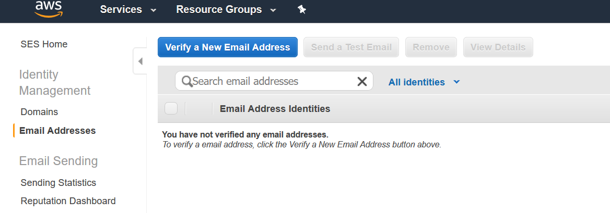

# Installation
```sh
$ npm install jovo-plugin-error-email@1.0.1 --save-exact
```
In your Jovo project:
```javascript
const ErrorEmail = require('jovo-plugin-error-email');

// Required:
let options = {
    fromEmail: 'fromEmail',
    toEmail: 'toEmail',
    subject: 'subject',
    awsConfig: {
        accessKeyId: 'access_key_id',
        secretAccessKey: 'secret_access_key',
        region: 'region'
    }
}
app.register('ErrorEmail', new ErrorEmail(options));
```

The plugin works with the [Amazon Simple Email Service](https://aws.amazon.com/ses/) and [nodemailer](https://nodemailer.com/about/). As you saw above you need to provide the credentials to an AWS account, which has to have the following policy attached:
```javascript
{
    "Statement": [
        {
            "Effect": "Allow",
            "Action": "ses:SendRawEmail",
            "Resource": "*"
        }
    ]
}
```
The email, which will be used to send out the messages, has to be verified!

Go to the `Email Addresses` tab on the AWS SES landing page:


and click on `Verify a New Email Address`:



After typing in your email address, you will receive a confirmation email and you're good to go.

# License

MIT