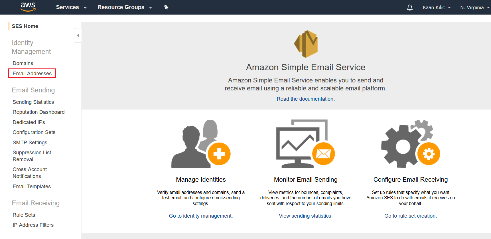

# Installation

> If you are using the Jovo Framework version < 2.0.0, please checkout the v1 branch [here](https://github.com/KaanKC/jovo-plugin-error-email/tree/v1)

```sh
$ npm install jovo-plugin-error-email --save
```

In your Jovo project:

```javascript
const {EmailErrorPlugin} = require('jovo-plugin-error-email');

const app = new App();

app.use(
    // other plugins, platforms, etc.
    new EmailErrorPlugin()
);
```

```javascript
module.exports = {
    // other configurations
    plugin: {
        EmailErrorPlugin: {
            fromEmail: 'fromEmail', // required
            toEmail: 'toEmail', // required
            subject: 'subject',
            awsConfig: {
                accessKeyId: 'access_key_id', // required
                secretAccessKey: 'secret_access_key', // required
                region: 'region' // required
            }
        },
        // other plugins
    }
};
```

The plugin works with the [Amazon Simple Email Service](https://aws.amazon.com/ses/) and [nodemailer](https://nodemailer.com/about/). As you saw above you need to provide the credentials to an AWS account, which has to have the following policy attached:

```javascript
{
    "Statement": [
        {
            "Effect": "Allow",
            "Action": "ses:SendRawEmail",
            "Resource": "*"
        }
    ]
}
```

The email, which will be used to send out the messages, has to be verified!

Go to the `Email Addresses` tab on the AWS SES landing page:



and click on `Verify a New Email Address`:


After typing in your email address, you will receive a confirmation email and you're good to go.

# License

MIT